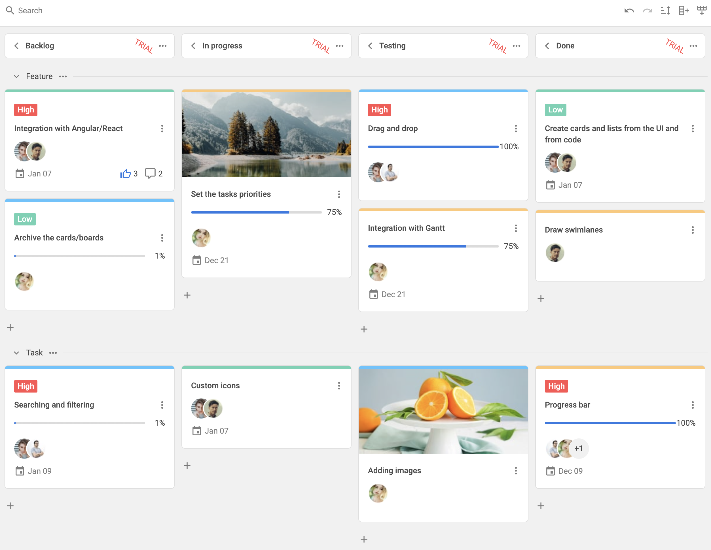

# DHTMLX Kanban with Svelte Demo

[](https://dhtmlx.com/)



## How to start

### Online

[](https://codespaces.new/DHTMLX/svelte-kanban-demo) 

### On the local host 

```
yarn 
yarn start
```

## Useful links

- **[Online demo](https://replit.com/@dhtmlx/dhtmlx-kanban-with-svelte)**
- [More demos about the DHTMLX Kanban functionality](https://snippet.dhtmlx.com/807qbp9v?tag=kanban&mode=wide)
- [Technical support ](https://forum.dhtmlx.com/c/kanban)
- [Online  documentation](https://docs.dhtmlx.com/kanban/)

## Follow us

- Star our GitHub repo :star:
- Watch our tutorials on [YouTube](https://www.youtube.com/user/dhtmlx/videos) :eyes:
- Read us on [Medium](https://dhtmlx.medium.com) :newspaper:
- Follow us on [Twitter](https://twitter.com/dhtmlx) :feet:
- Like our page on [Facebook](https://www.facebook.com/dhtmlx/) :thumbsup:
